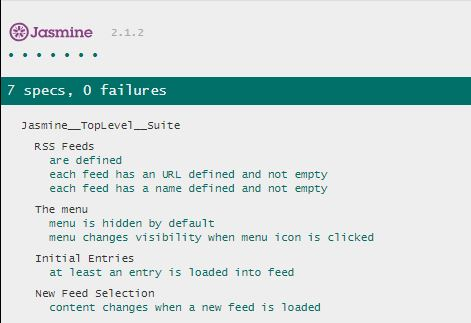

# Feed Reader Testing

## About the project
Jasmine test suites created during the Udacity/Google Front-End Web Developer Nanodegree Program, in order to test an existing feed reader app provided by Udacity.

## Loading the project
Download or clone this project and open the index.html file in your browser.

The Jasmine test suites and corresponding results will be displayed at the bottom of the webpage. Scroll down to view them.

To run a test/test suite again, click on the name of that test or test suite.
To run all tests again, click on "run all".

## Jasmine test suites
The Jasmine test suites are included in the file jasmine/spec/feedreader.js, and consist of the following tests:

- Test suite 1 - RSS Feeds
    - Test 1 - check if at least an RSS feed has been defined (test already written by Udacity)
    - Test 2 - check if each RSS feed has an URL defined, and the URL is not empty
    - Test 3 - check if each RSS feed has a name defined, and the name is not empty

- Test suite 2 - The Menu
    - Test 4 - check if the menu element is hidden by default when the webpage is loaded
    - Test 5 - check if the menu changes visibility when the menu icon is clicked (menu displayed when clicking the icon, menu hidden when clicking the icon again)

- Test suite 3 - Initial Entries
    - Test 6 - check if there is at least one entry in the feed, when the loadFeed function has completed its work

- Test suite 4 - New Feed Selection
    - Test 7 - check if the content of the webpage changes when a new feed is loaded by the loadFeed function

